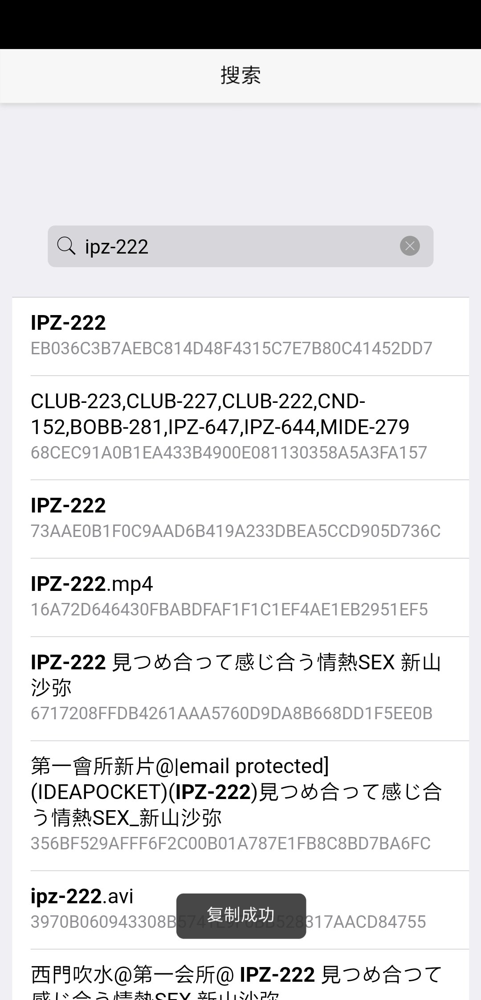

# btLink (未开发完.....修复bug_ing.....并且还在优化用户体验)
___
## 第一次使用Android+MUI开发应用,感觉特好用
[MUI文档移步](http://dev.dcloud.net.cn/mui/ui/)

## 开发环境
- MacOS
- IDE: Android Studio

## App 效果浏览





### 遇到的一些问题
+ `JavascriptInterface`返回的数据好像并不能用ArrayList与数组,不清楚用什么方法才能让js接收数组/对象,
此处为用的是将字符串拼接成js数组对象,然后js再用JSON.parse()方法将字符串转换成数组,然后遍历对象
```java
public String getResultList(String searchName) {
    int i = 0;
    String text = "";

    httpRequest request = new httpRequest();
    request.get("https://www.btcherries.com/search/"+searchName+"-1.html");

    //System.out.println(request.text());
    Pattern pattern = Pattern.compile("<a href=\"/magnet/(.*?).html\" target=\"_blank\">(.*?)</a>");
    Matcher matcher = pattern.matcher(request.text());

    while(matcher.find()) {
        text += "{";
        text += "\"link\":" + "\"" + matcher.group(1) + "\",";
        text += "\"name\":" + "\"" + matcher.group(2).replaceAll("\"", "'") + "\"";
        text += "},";
        i++;
    }

    text = text.replaceAll("\\[", "|");
    text = "[" + text.substring(0, text.length()-1) + "]";

    System.out.println(text);
    return text;
}
```

+ (待解决)因为用的是`WebView`, 在请求Android接口的时候会阻塞(导致js动画暂停), 如果后台用多线程的话,又太麻烦。暂时没有找到完美的解决方案
具体浏览 [search.html页面](https://github.com/1oid/btLink/blob/master/MUIStudy/search.html) 第`63`行

